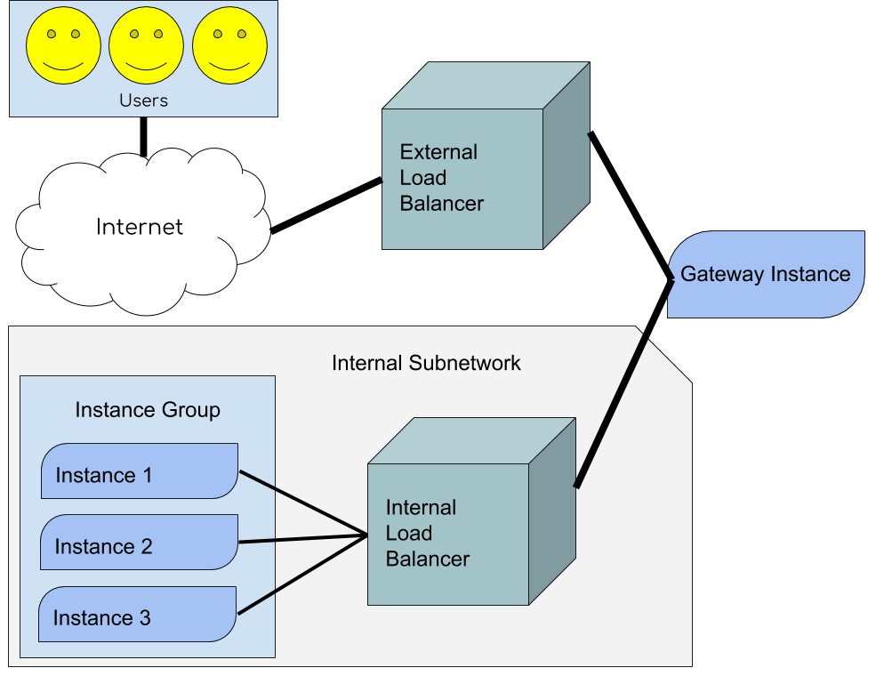

## DevOps to Infrastructure Engineer GCP

This is the repository for Capstone Project.

---

### Basic diagram

The user's request should go through External load balancer, then through Gateway
instance which should transfer all the traffic to the internal load balancer address
where the internal load balancer decides to which instance he should send this request 
depending on the usage of the instances.
